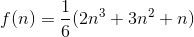

# Euler
the python/C code to solve the project Euler problem

### 1.数1000以下3或者5倍数的和
python:use time 0.0009973049 s  
C++:use time 0.001 s(与精度有关)  
将要做的工作:假设规模变大,不是求1000以内的,而是1000000000以内的,python还好,但是C++的int就会溢出,未来再解决。 

### 2.数4000000以下斐波拉契数列偶数项之和
python:use time 0.0000000000 s  
C++:use time 0.001 s(与精度有关)  
将要做的工作:假设规模变大,不是求1000以内的,而是1000000000以内的,python还好,但是C++的int就会溢出,未来再解决。 

### 3.数600851475143的最大质因数
python:use time 0.0565788746 s  
先用埃氏筛法制作出质数生成器,然后遍历质数集,使得600851475143做因式分解

### 4.最大两位三位数的积是回文数
python:use time 1.1280264854 s  
遍历一遍

### 5.1-20的最小公倍数
python:use time 0.0000000000 s  
将1-20每个数都做因数分解,然后逐一挑选因数出现最多的项,比如 3 因式分解是 3*1 , 而 9 是 3*3*1 ,所以结果里面最终是有两个 3 ,而不是三个 3 ,因为9包含了。同理这个脚本可以算很大的值的结果,测试了一下1-200的结果,337293588832926264639465766794841407432394382785157234228847021917234018060677390066992000 
use time 0.0049865246 s

### 6.和的平方与平方的和的差值
python:use time 0.0009970665 s  
在python中实现比较简单(直接遍历)。实际上是有平法的和的计算公式的  

### 7.计算第10001个质数
python:use time 7.3699765205 s  
参考第三题

### 8.计算相邻13个数字的最大积
python:use time 0.0049862862 s  
遍历计算一遍

### 9.设a,b,c满足a**2+b**2=c**2,a+b+c=1000,求abc
python:use time 0.1326451302 s  
遍历计算一遍

### 10.数2000000以内的质数和
python:use time 7.3699765205 s  
参考第三题  
值得注意的是：随着求解规模的扩大,每次需要增长的时间的倍数是越来越大,同时内存消耗的相当惊人,与我印象中理解的生成器相差甚远,日后研究 

|规模|时间|
|:-:|:-:|
|2|0.0000000000 s|
|20|0.0000000000 s|
|200|0.0000000000 s|
|2000|0.0070142746 s|
|20000|0.3625621796 s|
|200000|25.6672554016 s|
|2000000||
